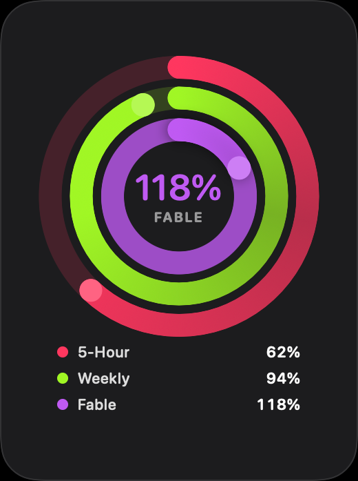

<p align="center">
  
</p>

<h1 align="center">Claude Usage Widget</h1>

<p align="center">
  A small always-on-top macOS widget that shows your Claude Code usage as
  concentric Apple-Watch-style activity rings.
</p>

<p align="center">
  <a href="https://github.com/melucasleite/claude-usage-widget/releases/latest">
    
  </a>
  
  
</p>

<p align="center">
  
</p>

## Download

**[⬇ Download the latest release](https://github.com/melucasleite/claude-usage-widget/releases/latest)**

Open the `.dmg` and drag the app across to Applications.

Requires macOS 14+ and a Claude subscription. On first launch it walks you
through generating a token — the widget reads *your* limits, nobody else's.

To keep it around permanently, add it under System Settings ▸ General ▸
Login Items.

Each ring is one limit:

| Ring | Colour | What it measures | Source |
|---|---|---|---|
| **5-Hour** | red | rolling 5-hour session window | live API |
| **Weekly** | green | 7-day rolling limit, all models | live API |
| **Fable** | violet | weekly Fable-model limit | live API |

Three rings, because three is what the plan actually exposes. They are
data-driven, so you can turn any of them off in Settings.

## Building from source

Not required to use it — [the release](https://github.com/melucasleite/claude-usage-widget/releases/latest)
is the easy path. This is for hacking on it.

```bash
git clone https://github.com/melucasleite/claude-usage-widget.git
cd claude-usage-widget
./Scripts/build-app.sh --run
```

That produces `dist/ClaudeUsageWidget.app` and launches it.

| | |
|---|---|
| `swift build` / `swift test` | day-to-day |
| `./Scripts/build-app.sh --run` | build the `.app` and launch |
| `./Scripts/make-icon.sh <png>` | regenerate the icon |
| `./Scripts/make-dmg.sh <version>` | drag-to-Applications disk image |
| `./Scripts/release.sh <version>` | sign, notarize, package, publish |
| `--check` | diagnose credentials and the live endpoint |

> **Xcode note.** SwiftUI's `@State` and friends are macros now, expanded by
> `libSwiftUIMacros.dylib`, which ships inside Xcode and *not* with the
> standalone Command Line Tools. The build script finds any installed Xcode
> automatically and borrows it via `DEVELOPER_DIR` — no `xcode-select` (and no
> `sudo`) required. Override it explicitly if you like:
>
> ```bash
> DEVELOPER_DIR=/Applications/Xcode.app/Contents/Developer ./Scripts/build-app.sh
> ```

## Usage

- **Hover a ring** to preview it: the centre readout switches to that ring's
  percentage, label and colour, and reverts when you leave. The tooltip adds
  the reset countdown and where the number came from.
- **Click a ring** to pin it there. Click it again to unpin. The choice
  persists across relaunches. Unpinned, the centre follows whichever ring is
  closest to its limit.
- **Drag** the widget anywhere. Its position is remembered.
- **Hover** the widget for its controls: close top-left, refresh and settings
  top-right. Close quits the app — the widget *is* the app, so leaving a menu
  bar item behind would not feel like closing. To keep it running but out of
  sight, use **Hide Widget** in the menu instead.
- **Right-click** the widget, or click the menu bar readout, for the full menu
  — including *Centre Shows*, which pins a ring without clicking one.
- **Always on top** is a toggle — in the menu, or in Settings → Appearance.

Reset countdowns live in the tooltip rather than on the face. The widget is
something you glance at, and a number that only matters once you are already
worried has not earned permanent space in the middle.

### Diagnostics

If the rings are not showing live data, ask the app why:

```bash
./dist/ClaudeUsageWidget.app/Contents/MacOS/ClaudeUsageWidget --check
```

It reports which Keychain items it found, whether the token parsed, whether the
endpoint answered, and which windows came back. It never prints a token value —
only metadata such as length and expiry.

### Regenerating the screenshot

```bash
./dist/ClaudeUsageWidget.app/Contents/MacOS/ClaudeUsageWidget --render-preview docs/rings.png --demo
```

`--demo` uses fixed representative values, so the image in this README contains
none of anyone's real numbers.

## How it gets the data

One source: `GET https://api.anthropic.com/api/oauth/usage` — the same endpoint
`/usage` inside Claude Code talks to. It returns exact percentages:

```json
{
  "five_hour":          { "utilization": 30.0, "resets_at": "..." },
  "seven_day":          { "utilization": 47.0, "resets_at": "..." },
  "seven_day_omelette": null
}
```

There is deliberately **no local estimation**. An earlier version derived
percentages from transcript token counts when the API was unreachable, which
meant inventing a denominator — a Max plan's quotas are not published — and it
once confidently displayed **3704%**. A ring that says "—" is more useful than
one that says something false, so unavailable data now stays unavailable.

This endpoint is **unofficial and undocumented**. Three things are worth
knowing if you build something similar:

- The `User-Agent: claude-code/<version>` header is not optional in practice.
  Without it you land in an aggressively rate-limited bucket and get persistent
  `429`s.
- **Per-model windows use internal codenames, not model names.** There is no
  `seven_day_fable`. A live response carries `seven_day_omelette` alongside
  decoys like `cinder_cove`, `nimbus_quill` and `iguana_necktie`. The mapping
  here is inferred by matching a live response against what `/usage` displayed
  — an inference, not a contract. Pin a different key in Settings if it moves.
- **`null` means 0%, not "unavailable".** A per-model key that is present but
  null means the window applies to your account with no usage yet, which is
  how `/usage` renders it.

### Rate limiting

The endpoint is limited more tightly than it looks. The widget polls every
three minutes by default and enforces a floor between calls regardless of what
asks, because the timer is not the only caller.

Backoff is **persisted to disk**. Keeping it in memory quietly defeats it:
quitting and reopening resets the timer and fires a request immediately, so a
handful of relaunches can turn a short `Retry-After` into an hour-long one.
`--check` honours the same wait and needs `--force` to override.

## Authentication

A single long-lived token from `claude setup-token`, pasted once:

```bash
claude setup-token
```

The app opens a setup guide on first run — generate, paste, save, test. The
test step actually calls the API, because "saved" is not the same as "works".

Claude Code's own stored token is deliberately **not** used. It expires every
few hours and is not reliably refreshed on disk, so a widget reading it goes
dark several times a day for reasons you cannot see or fix. It also sits behind
a Keychain access-control prompt that every rebuild invalidates.

`CLAUDE_CODE_OAUTH_TOKEN` is honoured too, but only when the app is launched
from a shell — an app opened from Finder inherits no environment, which is why
the paste field exists at all.

### Security

- The token is written only when you paste one in, and only to the Keychain:
  never to `config.json`, never to logs, never to disk in the clear.
- It lives in a Keychain item **this app creates**. An application always has
  access to its own items, so reading it never prompts.
- Stored device-only and after-first-unlock: no iCloud sync, unreadable while
  the Mac is locked.
- `OAuthCredentials` prints `<redacted>`, so interpolating one into a log line
  cannot leak it. A unit test asserts this, so removing the redaction turns the
  build red.
- No credential of any kind is in this repository.

### Diagnostics

```bash
./dist/ClaudeUsageWidget.app/Contents/MacOS/ClaudeUsageWidget --check
```

Reports where the token came from, whether the endpoint answered, and which
rings resolved. It never prints a token value.

## Architecture

```
Sources/ClaudeUsageWidget/
├── main.swift                  entry point; --check and --render-preview
├── App/
│   ├── AppDelegate.swift       wiring, windows, main menu
│   ├── WidgetPanel.swift       borderless non-activating NSPanel
│   ├── StatusItemController.swift
│   ├── Diagnostics.swift       --check
│   └── PreviewRenderer.swift   --render-preview
├── Core/
│   ├── Models.swift            RingMetric, RingDatum, UsageSnapshot
│   └── Config.swift            settings, persisted as JSON
├── Data/
│   ├── CredentialStore.swift   Keychain, token sanitising, redaction
│   ├── OAuthUsageProvider.swift  the endpoint and its tolerant decoder
│   └── UsageCoordinator.swift  refresh loop, persisted backoff
└── UI/
    ├── ActivityRingsView.swift adaptive geometry, overflow laps
    ├── WidgetView.swift        rings, or the setup prompt
    ├── OnboardingView.swift    generate → paste → save → test
    └── SettingsView.swift
```

Settings and rate-limit state live in
`~/Library/Application Support/ClaudeUsageWidget/`. The token does not — it is
in the Keychain.

## Distribution

The Mac App Store is not an option for this app, and the reason is structural
rather than bureaucratic: **MAS requires sandboxing**, and a sandboxed app
cannot read Claude Code's Keychain item, cannot read `~/.claude/projects`
outside its container, and cannot invoke `/usr/bin/security`. That is every one
of this app's data paths.

The route for Mac utilities is **Developer ID + notarization** — no store, no
review.

### Generating the Xcode project

Everyday work needs no Xcode project (`swift build`, `swift test`,
`./Scripts/build-app.sh`). But a Swift *package* opened in Xcode has no
Signing & Capabilities tab and no `Product ▸ Archive`, so the Organizer flow
that notarizes a Developer ID build is unavailable. For that you need a real
App target:

```bash
brew install xcodegen && DEVELOPMENT_TEAM=YOURTEAMID xcodegen generate && open ClaudeUsageWidget.xcodeproj
```

Pass `DEVELOPMENT_TEAM` rather than setting the team in Xcode's UI. The UI
writes it into the generated project, which the next `xcodegen generate`
overwrites.

`project.yml` is the source of truth; the `.xcodeproj` is generated and
git-ignored, so it cannot drift from the sources or rot into an unreviewable
binary diff. Regenerate it whenever you add a file.

### Signing certificates: the iOS gotcha

Two certificate types look plausible here and only one works.

| Certificate | What it is for | Works outside the store? |
|---|---|---|
| **Apple Development** | local builds, registered devices | no — blocked on other Macs |
| **Apple Distribution** | App Store / TestFlight submissions | no — not a Gatekeeper identity |
| **Developer ID Application** | direct distribution | **yes** |

Coming from iOS, *Apple Distribution* is the trap: it is the certificate you
already use for TestFlight, so it reads as the "release" one. It is not
accepted for notarized direct distribution.

Create a **Developer ID Application** certificate in Xcode ▸ Settings ▸
Accounts ▸ Manage Certificates ▸ **+**. It requires the paid Apple Developer
Program, and the option only appears if you are the **Account Holder** on the
team.

Verify you have the right one:

```bash
security find-identity -v -p codesigning | grep "Developer ID Application"
```

You can confirm the whole chain before ever archiving:

```bash
CODESIGN_IDENTITY="Developer ID Application: Your Name (TEAMID)" ./Scripts/build-app.sh && spctl -a -vvv -t install dist/ClaudeUsageWidget.app
```

A correctly signed but not-yet-notarized app reports `rejected` with
`source=Unnotarized Developer ID`. That is the expected result at that stage —
it means everything except notarization is right.

`Scripts/build-app.sh` deliberately prefers whatever certificate it finds for
*local* builds — that is only about keeping Keychain grants stable across
rebuilds, and is unrelated to distribution.

### Archiving and notarizing

In Xcode: select the target ▸ **Signing & Capabilities** ▸ set your Team, then
`Product ▸ Archive` ▸ **Distribute App** ▸ **Direct Distribution**. Xcode
notarizes and staples for you.

The equivalent from the command line:

```bash
xcrun notarytool submit ClaudeUsageWidget.zip --keychain-profile AC_PASSWORD --wait
```

```bash
xcrun stapler staple dist/ClaudeUsageWidget.app
```

Stapling matters — it embeds the ticket so the app validates without a network
round trip on your friend's machine.

Hardened runtime is enabled in `project.yml` (notarization rejects builds
without it) and the sandbox is explicitly off, for the reasons above.

### App icon

```bash
./Scripts/make-icon.sh ~/Downloads/your-icon.png
```

Generates `Resources/AppIcon.icns`. Both build paths pick it up automatically —
no online generator, and no uploading your artwork anywhere.

Unlike iOS, where Xcode slices a single 1024px image for you, a macOS `.icns`
wants the full set: 16/32/128/256/512 at both scale factors, ten files. `sips`
and `iconutil` ship with macOS and do all of it. A non-square source is padded
rather than cropped, on the grounds that silently eating part of someone's
artwork is worse than a bit of transparency.

For the macOS 26+ layered look — automatic light, dark, clear and tinted
variants — use **Icon Composer**, bundled inside Xcode:

```bash
open "/Applications/Xcode.app/Contents/Applications/Icon Composer.app"
```

That exports a `.icon` rather than a `.icns`, and is a design exercise rather
than a packaging step. A plain `.icns` works fine everywhere.

### Cutting a release

```bash
./Scripts/release.sh 1.0.0
```

Signs with the Developer ID certificate, notarizes, staples, verifies, builds
both a drag-to-Applications `.dmg` and a `.zip` with checksums, and creates the
GitHub Release. The disk image is notarized and stapled separately from the app
inside it — Gatekeeper assesses the container the user double-clicks, so
stapling only the app leaves the `.dmg` itself unnotarized. Useful flags: `--no-publish`
to package only, `--draft`, and `--app PATH` to reuse a bundle you already
built (a bundle that already carries a stapled ticket is not re-submitted).

Notarization credentials are stored once — this needs an app-specific password
from appleid.apple.com, so it is yours to run:

```bash
xcrun notarytool store-credentials "ClaudeUsageWidget" --apple-id you@example.com --team-id YOURTEAMID
```

The script fails early rather than late. It refuses to submit anything missing
the hardened runtime or a secure timestamp — both guaranteed rejections that
would otherwise surface fifteen minutes into Apple's queue — and after
stapling it re-runs the Gatekeeper check on a **copy tagged with a download
quarantine flag**. That last part matters: an app assessed on the machine that
built it can pass while still being refused as a download, which is the only
context that counts.

### Or just have them build it

The repository is public and `./Scripts/build-app.sh` works from a clean clone.
For a technical friend that is zero cost and no Apple paperwork.

Either way, the widget is only useful to someone with their own Claude
subscription: it reads their limits using a token they generate themselves,
never yours.

## Tests

```bash
swift test
```

Covers the parts that fail quietly: decoding a payload whose key names are not
guaranteed, resolving Fable through a codename, treating a null model window as
0%, stripping whitespace from a terminal-wrapped token, token redaction, ring
hit-testing, and the rule that cosmetic settings never trigger a network call.

## Caveats

- The usage endpoint is unofficial. If it changes, the rings go quiet and say
  so — there is no fallback that invents numbers.
- The Fable codename mapping is inferred from observation, not documented.
- Requires a Claude subscription with usage limits to report.

## License

MIT — see [LICENSE](LICENSE).
